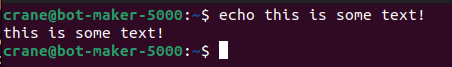
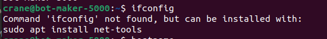
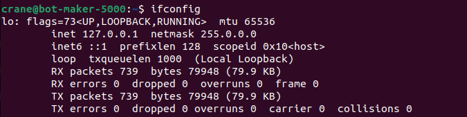
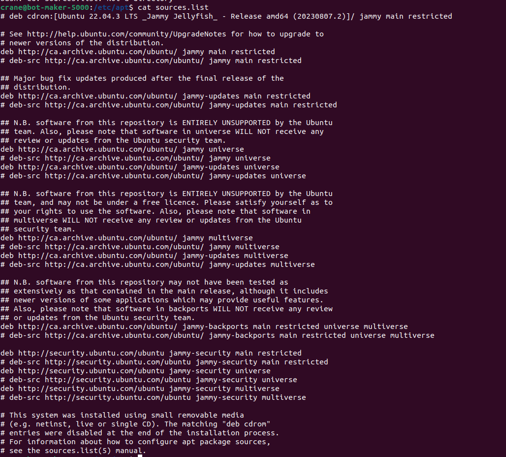
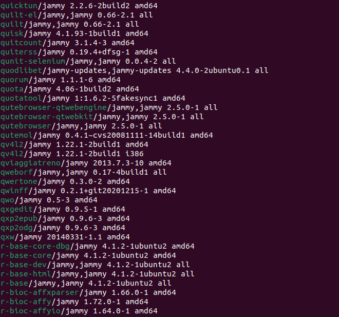

# Assignment 1

## 1.

### a.

`echo` is, I believe, Bash's `print()` or `console.log()` -type command. It prints out the following text to screen.

---

### b.

`whoami` reports the user profile currently active/logged in.

---

### c.

`hostname` reports the machine's given name.

---

### d.

The first time I used `ifconfig`, it returned a message hinting that I install a tools package. I include this in this assignment response to note that Ubuntu Linx has a neat feature where it will try and match the program you are looking for when there's no match with your installed programs.

The command `sudo apt install net-tools` can be broken down like so:
	
1. `sudo` is short for "**su**peruser **do**". This keyword, I believe, provides some access to admin privileges.
2. `apt` is a commandline package manager for Linux, I believe. It assists in installing and managing packages.
3. `install` is the keyword to install a desired package.
4. `net-tools` is the name of the necessary package.

After running that, I was able to use `ifconfig`.

I am not including the full results of this command, just in case any of the information is sensitive. But I believe that the output is a summary of my system's current network connections. I believe that the first -- given the IP 127.0.0.1 -- is localhost, and is least likely to hold vulnerable information in its summary.

## 3. 

I started with googling for the context of "software repositories", and came up with a two-part answer.

I first found [this](https://linuxsimply.com/linux-basics/package-management/repository-list/apt/) article that pointed me toward what specific repositories I should be seeking. So I navigated to `~/etc/apt` and opened `sources.list`:

I was namely surprised that there were so few repositories listed here, however the ones listed appear to be official Ubuntu softward given the URL.

Because of the mention of "apt", I looked into `apt`'s commands with `apt help` and found `apt list`, a command that lists all package names.

This returned an incredibly long list of names, the screenshot being only a fraction. 

At this point, I recalled there was a difference between "package" and "repository". The information in `sources.list` is therefore more likely an appropriate response to this question, as it provides navigation to a remote repository.
