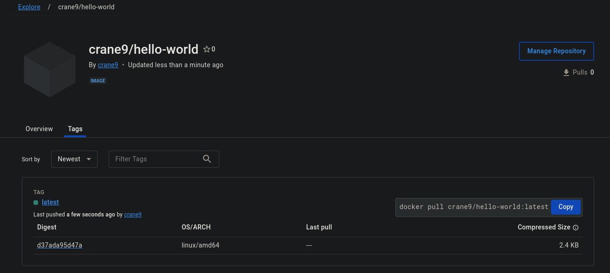

# Assignment 7

I tested three images to get to know Docker.


## Hello World 



Hello world clone image can be found [here](https://hub.docker.com/repository/docker/crane9/hello-world/general).

## Alpine container

I launched an interactive Alpine terminal with:
```bash
sudo docker run -v testVol:/output -it alpine
```

I played around with a few commands and the package manager, and saved the output of three commands:

1. `cat /etc/os-release >> `[`/output/os-release.txt`](./alpine-output/os-release.txt)
2. `apk stats >> `[`/output/apk-stats.txt`](./alpine_output/apk-stats.txt)
3. `ping -w 2 cranepresents.dev >> `[`/output/ping.txt`](./alpine_output/ping.txt)

Which I manually moved to this repository.


## Webserver Test

To test building and running a Dockerfile myself,  I created a super-simple NodeJS server (see [`./src`](./src/)) that would return a PNG file if successfully reached.

I built this image and called it "world" with `sudo docker build -t world .`, and ran it with `sudo docker run -it world`. 

Once within the container, I manually ran `nodejs srv/server.js` to run the server. Then from another terminal, I used `sudo docker inspect <containerID> | grep IPAddress` to find the IP. I then accessed port 8080 on that address and was greeted with the expected PNG.
